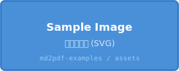
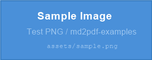

# 画像

## ローカル画像（SVG）

*図 1: SVG 形式のテスト画像（ベクター形式）*

## ローカル画像（PNG）

*図 2: PNG 形式のテスト画像*

## 画像サイズの指定

HTML 属性で幅を指定（Pandoc 拡張）：

{width=50%}

## 画像のキャプション

Pandoc では `` の形式で、`![...]` 部分がそのままキャプションになります。

## 画像参照スタイル

参照リンクスタイルでの画像挿入：

![別の参照スタイル][ref-img]

[ref-img]: assets/sample.svg "ツールチップテキスト"

## 複数画像の並置

| | |
|---|---|
| {width=45%} | {width=45%} |

*表の中に画像を並べるテスト*

## メモ

- **SVG 対応**: Chrome 系（md-to-pdf, Marp）と WeasyPrint は SVG をネイティブ処理。LaTeX 系は `librsvg2-bin` (`rsvg-convert`) 経由で変換。
- **PNG 対応**: 全ツールが対応。最も互換性が高い。
- **幅指定**: `{width=...}` は Pandoc 拡張属性。md-to-pdf / Marp / Quarto でも通常は機能するが、挙動に差がある場合あり。
